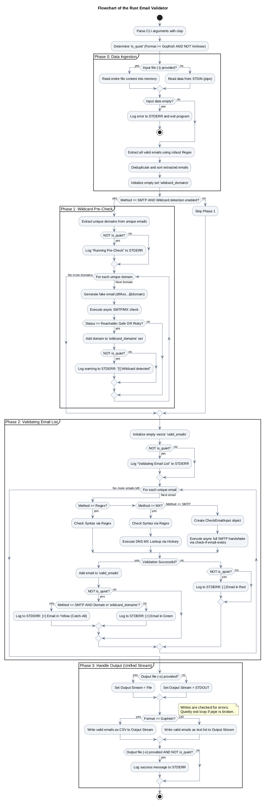
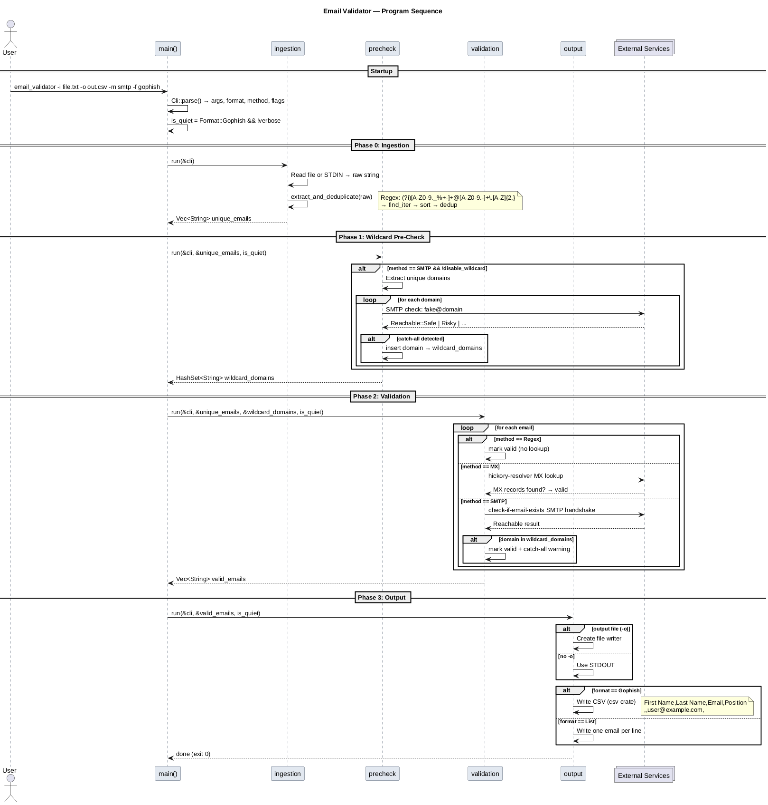

# 📧 Email Validator

> Fast, statically linked email list validator in Rust — zero runtime overhead.

**Email Validator** extracts, deduplicates, and validates email addresses from any
text source (TXT, Markdown, XML, CSV, STDIN pipes). Three validation modes:
regex only, MX lookup, or full SMTP handshake.

---

## 🚀 Quickstart

```bash
# Simplest usage: file in, validated list out
email_validator -i input.txt -o verified.txt

# Regex-only validation (no network)
email_validator -i mails.txt -m regex

# GoPhish CSV output format
email_validator -i mails.txt -o out.csv -f gophish

# JSON output for n8n / API / automation
email_validator -i mails.txt -j | jq

# Via pipe (STDIN)
cat mails.txt | email_validator -f list
```

---

## 📥 Download (Standalone Binary)

The binary is **statically linked** (musl), **compressed with UPX**, and runs on
**any Linux x86_64** — Alpine, Arch, Debian, Ubuntu, CentOS, embedded systems.
No glibc, no runtime dependencies.

👉 **[Download latest release](../../releases/latest)**

Simply make it executable and go:

```bash
chmod +x email_validator
./email_validator -i emails.txt -o clean.txt
```

---

## 🛠️ Options

| Flag | Description | Default |
|------|-------------|---------|
| `-i` | Input file (optional, STDIN otherwise) | `—` |
| `-o` | Output file (optional, STDOUT otherwise) | `—` |
| `-m` | Validation method: `regex`, `mx`, `smtp` | `smtp` |
| `-f` | Output format: `list`, `gophish` | `list` |
| `-j` | JSON array output (conflicts with `-f`) | `false` |
| `-d` | Disable wildcard domain check | `false` |
| `-v` | Verbose mode | `false` |

---

## 🔍 Validation Methods

| Method | Description | Network |
|--------|-------------|---------|
| `regex` | Syntax check via RFC-compliant regex | ❌ |
| `mx`   | Regex + MX record lookup of domain | ✅ |
| `smtp` | Regex + MX + SMTP handshake (RCPT TO) | ✅ |

---

## � Output Formats

| Flag | Format | Includes |
|------|--------|----------|
| `-f list` (default) | One valid email per line | Valid only |
| `-f gophish` | CSV: `First Name,Last Name,Email,Position` | Valid only |
| `-j` / `--json` | JSON array | All emails (valid + invalid) |

### JSON Output (`-j`)

Designed for n8n, automation pipelines, and API consumption. Each email is an object
with `email`, `valid`, and optionally `catch_all` (only present when `true`):

```json
[
  { "email": "alice@example.com", "valid": true },
  { "email": "bob@catch-all.tld", "valid": true, "catch_all": true },
  { "email": "nobody@no-mx-xyz123.de", "valid": false }
]
```

Use with `jq` for filtering and transformation:
```bash
# Extract only valid emails
email_validator -i mails.txt -j -m smtp | jq '[.[] | select(.valid)]'

# Pipe directly into n8n webhook
email_validator -i mails.txt -j -o result.json
```

---

## �📋 Supported Input Formats

The regex parser reliably extracts emails from:

- **TXT** — prose, lists, CSV exports
- **Markdown** — links, code blocks, tables, `mailto:` links
- **XML** — attributes, CDATA sections, text nodes
- **HTML** — tags, attributes, plaintext
- Any **mixed content** with noise, special characters, and broken entries

Duplicates (including case-insensitive variants) are automatically detected and removed.

---

## 🧪 Build from Source

```bash
# Clone the repository
git clone https://github.com/USERNAME/email_validator.git
cd email_validator

# Build a static binary (requires musl toolchain)
rustup target add x86_64-unknown-linux-musl
cargo build --release --target x86_64-unknown-linux-musl

# Optional: compress with UPX (~8 MB → ~3 MB)
upx --best --lzma target/x86_64-unknown-linux-musl/release/email_validator
```

Run tests (32 total, all green ✅):

```bash
cargo test
```

---

## � Architecture

### Program Flow



### Sequence Diagram



```bash
# Regenerate diagrams (requires plantuml)
cd doc && plantuml *.puml
```

---

## 🛠️ Developer Documentation

Module-level docs for all internal types and functions.

### Browse Online

👉 **[Developer Docs](https://evait-security.github.io/email_validator/email_validator/)** — live on GitHub Pages.

### Build Locally

```bash
cargo doc --no-deps --open
```

### Download

A tarball of the docs is also attached to every [release](../../releases/latest)
as `email_validator_docs.tar.gz`.

This opens a local browser with docs for `ingestion`, `precheck`,
`validation`, `output`, and all public types.

---

## �📜 License

This project is licensed under the **MIT License**.

- [Full license text](LICENSE)
- [What MIT means (choosealicense.com)](https://choosealicense.com/licenses/mit/)

You may copy, modify, distribute, and use it in your own projects
(including commercial software) with proper attribution.

---

## 🧬 Tech Stack

- **Rust** (Edition 2024)
- **musl** — fully static linking
- **UPX** — binary compression for minimal download size
- **Property-Based Testing** via `proptest` for fuzzing Markdown/XML/noise inputs
- **CI/CD** via GitHub Actions (tests + automatic release)
